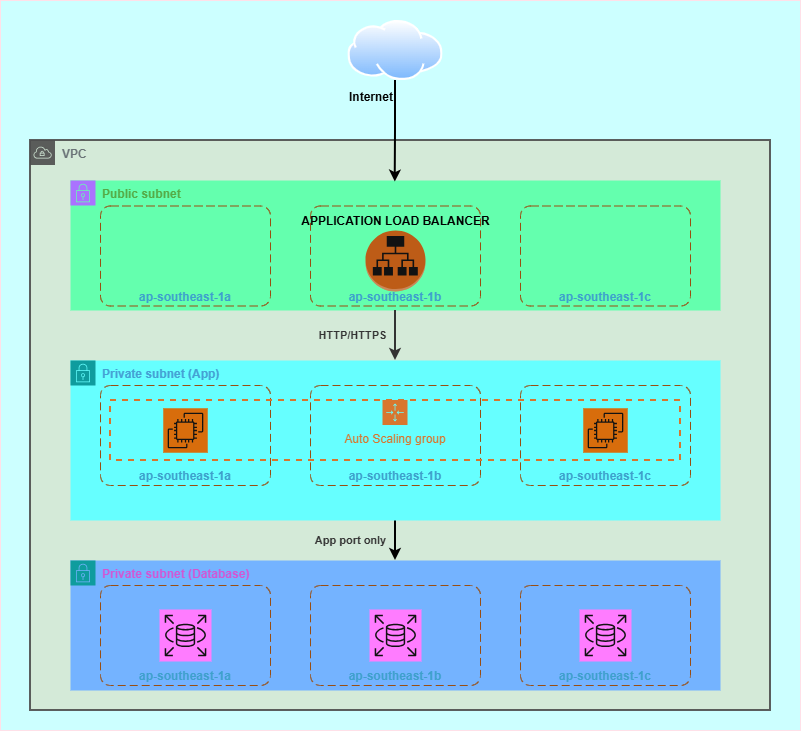

# AWS Three-Tier Architecture with Terraform

A production-style AWS three-tier infrastructure deployed entirely with **Terraform**, protected by a CI/CD pipeline on **GitHub Actions** with automated security checks integrated at every step before apply.

---

## Table of Contents

- [Architecture Overview](#architecture-overview)
- [Architecture Diagram](#architecture-diagram)
- [Infrastructure Components](#infrastructure-components)
- [Directory Structure](#directory-structure)
- [CI/CD Pipeline & OPA/Rego Policies](#cicd-pipeline--oparego-policies)
- [Prerequisites](#prerequisites)
- [Quick Start](#quick-start)
- [References](#references)

---

## Architecture Overview



Internet traffic enters only through the ALB. The App tier resides in private subnets and only accepts connections from the ALB Security Group. RDS resides in a dedicated DB subnet group and only accepts connections from the App tier Security Group — no direct internet route exists.

---

## Architecture Diagram


---

## Infrastructure Components

### Web Tier — Public Subnet

| Component | Details |
|-----------|---------|
| Application Load Balancer | Internet-facing, multi-AZ required (≥ 2 subnets) |
| EC2 Web Servers | Public subnet, ports 80/443 open from internet |
| Internet Gateway | Allows inbound/outbound traffic for public subnets |

### App Tier — Private Subnet

| Component | Details |
|-----------|---------|
| EC2 Application Servers | Private subnet, no public IP |
| Auto Scaling Group | Spread across ≥ 2 Availability Zones |
| NAT Gateway | Outbound-only internet access (package updates, AWS API calls) |

### Data Tier — Private Subnet (DB)

| Component | Details |
|-----------|---------|
| RDS MySQL 8.0 / PostgreSQL | `publicly_accessible = false`, `storage_encrypted = true` |
| DB Subnet Group | `db_subnet_group_name` required, no deployment on public subnets |
| Backup | `backup_retention_period >= 7` days |

### Shared Components

| Component | Purpose |
|-----------|---------|
| VPC | `enable_dns_hostnames = true`, `enable_dns_support = true` |
| Route Tables | Separate routing table per tier |
| Security Groups | Least-privilege per tier, with clear descriptions |
| IAM | Instance profiles, role-based — no inline policies directly on users |
| CloudWatch | Log groups, metric alarms for infrastructure |
<!-- | CloudTrail | Multi-region, log file validation, integrated with CloudWatch Logs | -->

---

## Directory Structure

```
AWS-Three-Tier-Architecture/
│
├── .github/
│   └── workflows/
│       ├── terraform-ci.yml       # Static checks — no AWS credentials required
│       ├── terraform-cd.yml       # Plan → OPA gate → Apply / Destroy
│       ├── check-scan.yml         # Daily scheduled security scan
│       └── CICD-GUIDE.md          # Detailed setup and operations guide
│
├── environments/
│   ├── dev/
│   │   ├── backend.tf             # S3 remote state: dev/terraform.tfstate
│   │   ├── main.tf                # Module calls
│   │   ├── variables.tf
│   │   ├── outputs.tf
│   │   ├── providers.tf
│   │   ├── versions.tf
│   │   └── terraform.tfvars       # Variable values for dev environment
│   └── prod/
│       └── ...                    # Same structure as dev
│
├── modules/
│   ├── vpc/                       # VPC, subnets, IGW, NAT, route tables
│   ├── security-group/            # Per-tier security groups
│   ├── alb/                       # Application Load Balancer
│   ├── ec2/                       # Web and App tier EC2 instances
│   ├── s3/                        # Log storage
│   ├── autoscaling/               # Auto Scaling Group for App tier
│   ├── rds/                       # RDS MySQL/PostgreSQL
│   └── monitoring/                # CloudWatch, alarms, log groups
│
├── policies/
│   ├── security.rego              # EC2 IMDSv2, RDS, Security Group, IAM
│   ├── networking.rego            # VPC, subnet isolation, ALB, routing
│   └── compliance.rego            # CIS Benchmark v1.5.0 + Tagging policy
│
├── PROJECT.md
└── README.md
```

---

## CI/CD Pipeline & OPA/Rego Policies

```bash
Workflow Files
- terraform-ci.yml  - CI checks for dev (validate, tflint, tfsec, checkov) - triggered on push/PR to develop and feature/**
- terraform-cd.yml  - CD deployment for dev (plan, opa-gate, deploy, destroy)
- check-scan.yml    - Periodic security scan (OPA full check, tfsec deep, reports)
- policies/security.rego    - Security policies
- policies/networking.rego  - Networking policies
- policies/compliance.rego  - CIS Benchmark compliance
```

Three separate workflows, each running independently.

```
Push to feature/** or develop
            │
            ▼
   ┌─────────────────┐
   │  terraform-ci   │  fmt · validate · TFLint · tfsec · Checkov
   └────────┬────────┘  (no AWS credentials required, uses -backend=false)
            │ pass
            ▼
   ┌─────────────────┐
   │  terraform-cd   │  plan → OPA gate → apply
   └────────┬────────┘  (runs only on push to develop or workflow_dispatch)
            │
            ▼
   ┌─────────────────┐
   │   check-scan    │  OPA full scan + tfsec deep
   └─────────────────┘  (runs automatically at 02:00 GMT+7 daily)
```

### terraform-ci.yml — Static Analysis

Trigger: push to `develop` / `feature/**`, or Pull Request into `develop`.
No AWS credentials required — all steps use `terraform init -backend=false`.

> On `feature/**` branches: `SOFT_FAIL=true` — scan errors are reported but do not block the workflow.

| Job | Content | Result |
|-----|---------|--------|
| `validate` | `terraform fmt -check`, `init -backend=false`, `validate` | Fails on format or syntax errors |
| `tflint` | AWS ruleset, naming conventions, required providers, documented variables | JSON report → artifact + PR comment |
| `tfsec` | IaC security scan, compared against AWS best practices | Fails if critical issues found |
| `checkov` | CIS / NIST / PCI DSS compliance scan | SARIF upload to GitHub Security tab + PR comment |
| `ci-summary` | Aggregates results from the 4 jobs above | Single summary comment on PR + Slack notification |

### terraform-cd.yml — Plan, OPA Gate, Apply

Trigger: push to `develop` (auto-apply) or `workflow_dispatch` with `action` selection.

| Job | Content |
|-----|---------|
| `plan` | `terraform init` with real S3 backend, `terraform plan`, exports 2 artifacts: binary plan (for apply) and JSON plan (for OPA) |
| `opa-gate` | Downloads JSON plan from artifact, runs `security.rego` → `networking.rego` → `compliance.rego` in sequence. Any `deny` rule violation blocks the entire pipeline |
| `deploy` | `terraform apply` using the approved binary plan — only runs after `opa-gate` passes |
| `destroy` | `terraform destroy` — only runs when `workflow_dispatch` with `action=destroy`, never automatically |
| `notify` | Sends Slack notification with plan / opa-gate / deploy status |

**workflow_dispatch options:**

| action | Result |
|--------|--------|
| `plan` | Runs plan only, previews changes, does not apply |
| `apply` | plan → OPA gate → terraform apply |
| `destroy` | terraform destroy (requires confirmation via GitHub Environment) |

### check-scan.yml — Periodic Security Scan

Trigger: cron `0 19 * * *` (02:00 GMT+7 daily) or `workflow_dispatch`.

| Job | Content |
|-----|---------|
| `opa-full-scan` | Generates a fresh plan JSON from AWS, runs all 3 policy files, separates `deny` and `warn` into `opa-results.json` |
| `tfsec-deep` | Scans all rules without skipping, outputs JSON |
| `generate-reports` | Aggregates results into Step Summary, uploads artifact, sends Slack notification |

**workflow_dispatch options:**

| scan_type | Result |
|-----------|--------|
| `all` | Runs both OPA full scan and tfsec deep |
| `opa-only` | Runs OPA only with the latest plan JSON |
| `tfsec-only` | Runs tfsec deep scan only |

---

## Policy-as-Code with OPA/Rego

Every run of `terraform-cd.yml` and `check-scan.yml` exports the Terraform plan to JSON and passes it through 3 policy files before any resource is created.

```
tfplan.json
    │
    ├── policies/security.rego    → data.terraform.security.deny / .warn
    ├── policies/networking.rego  → data.terraform.networking.deny / .warn
    └── policies/compliance.rego  → data.terraform.compliance.deny / .warn
```

**Classification:**
- `deny` — critical violation, returns a message, pipeline stops, no deploy
- `warn` — warning, printed to job log but pipeline continues

### security.rego

Checks: EC2, Launch Template, RDS, Security Group, IAM.

| Rule | Type |
|------|------|
| EC2 and Launch Template must enforce IMDSv2 (`http_tokens = "required"`) | deny |
| RDS must have `storage_encrypted = true` | deny |
| RDS must have `publicly_accessible = false` | deny |
| RDS must have `backup_retention_period >= 7` | deny |
| Security Group must not open SSH (22) or RDP (3389) to `0.0.0.0/0` | deny |
| Security Group must not open MySQL (3306) or PostgreSQL (5432) to `0.0.0.0/0` | deny |
| Security Group must not have `protocol = -1` (all traffic) from `0.0.0.0/0` | deny |
| IAM Policy must not have `Action=*` and `Resource=*` simultaneously (array and string formats) | deny |
| Must not attach inline policies directly to IAM users (`aws_iam_user_policy`) | deny |
| ALB should have `access_logs` enabled | warn |
| RDS should have `deletion_protection` enabled | warn |
| EC2 without `key_name` should ensure SSM Session Manager is available | warn |

### networking.rego

Checks: VPC, Subnet, App tier EC2, RDS, ALB, Security Group.

| Rule | Type |
|------|------|
| VPC must have `enable_dns_hostnames = true` and `enable_dns_support = true` | deny |
| Subnets tagged `Tier=app` or `Tier=database` must not have `map_public_ip_on_launch = true` | deny |
| EC2 tagged `Tier=app` must not have `associate_public_ip_address = true` | deny |
| RDS must have `db_subnet_group_name` set (must reside in a DB subnet group) | deny |
| ALB tagged `Tier=web` must have `internal = false` (internet-facing) | deny |
| ALB must be deployed across at least 2 subnets (multi-AZ) | deny |
| Security Group must not have `description = "managed by terraform"` | deny |
| DB tier Security Group must not have egress `protocol=-1` to `0.0.0.0/0` | deny |
| VPC should have `aws_flow_log` to capture network traffic | warn |
| Web tier ALB Listener should use port 443 (HTTPS) | warn |
| No `aws_nat_gateway` found in plan | warn |

### compliance.rego

Checks: S3, CloudTrail, IAM — aligned with CIS AWS Foundations Benchmark v1.5.0. Includes an organizational Tagging policy.

| Rule | CIS | Type |
|------|-----|------|
| S3 must have `server_side_encryption_configuration` | 2.1.1 | deny |
| S3 versioning must be `status = "Enabled"` | 2.1.2 | deny |
| S3 must have all 4 public access block settings enabled | 2.1.3 | deny |
| At least 1 `aws_cloudtrail` resource must exist | 3.1 | deny |
| CloudTrail must have `enable_log_file_validation = true` | 3.2 | deny |
| CloudTrail must have `cloud_watch_logs_group_arn` set | 3.4 | deny |
| CloudTrail must have `is_multi_region_trail = true` | 3.5 | deny |
| Must not use `aws_iam_user_policy` or `aws_iam_policy_attachment` on users | 5.1 | deny |
| IAM Policy must not have `Action=*` and `Resource=*` | 5.2 | deny |
| RDS must have `storage_encrypted = true` | 5.4 | deny |
| Resources (EC2, RDS, ALB, VPC, Subnet, SG, S3) must have tags: `Environment`, `Project`, `ManagedBy` | Org Policy | deny |
| S3 should have access logging enabled | 2.1.4 | warn |
| A `aws_cloudwatch_metric_alarm` for unauthorized API calls should exist | 4.1 | warn |
| RDS should have `multi_az` enabled | — | warn |
| Auto Scaling Group should span ≥ 2 Availability Zones | — | warn |

---

## Prerequisites

| Requirement | Used by |
|-------------|---------|
| AWS Account + IAM User (programmatic access) | terraform-cd, check-scan |
| S3 bucket for Terraform remote state (versioning + encryption enabled) | terraform-cd, check-scan |
| DynamoDB table `terraform-state-lock` for state locking | terraform-cd, check-scan |
| GitHub Secrets (5 variables, see table below) | All 3 workflows |
| GitHub Environments: `development`, `production` | terraform-cd |
| `environments/dev/terraform.tfvars` with all required variable values | terraform-cd, check-scan |

### Required GitHub Secrets

| Secret | Description |
|--------|-------------|
| `AWS_ACCESS_KEY_ID` | IAM User access key |
| `AWS_SECRET_ACCESS_KEY` | IAM User secret key |
| `BUCKET_TF_STATE` | S3 bucket name for Terraform state |
| `SLACK_WEBHOOK_URL` | Slack Incoming Webhook URL (optional) |

See `CICD-GUIDE.md` for step-by-step instructions on creating each item above.

---

## Quick Start

### 1. Create S3 backend and DynamoDB lock table

```bash
# Option A: Using AWS CLI
# Create S3 bucket
aws s3api create-bucket \
  --bucket <bucket-name> \
  --region ap-southeast-1 \
  --create-bucket-configuration LocationConstraint=ap-southeast-1

aws s3api put-bucket-versioning \
  --bucket <bucket-name> \
  --versioning-configuration Status=Enabled

# Create DynamoDB lock table
aws dynamodb create-table \
  --table-name terraform-state-lock \
  --attribute-definitions AttributeName=LockID,AttributeType=S \
  --key-schema AttributeName=LockID,KeyType=HASH \
  --billing-mode PAY_PER_REQUEST \
  --region ap-southeast-1

# Option B: Using the backend/ Terraform module
cd backend/
terraform init
terraform plan
terraform apply
```

### 2. Configure backend and tfvars

Update `environments/dev/backend.tf` with the bucket name, then populate `environments/dev/terraform.tfvars` with the actual values (VPC CIDR, instance type, AMI ID, etc.).

### 3. Validate locally before pushing

```bash
cd environments/dev
terraform init
terraform validate
terraform fmt -recursive
```

### 4. Trigger CI by pushing to a feature branch

```bash
git checkout -b feature/initial-infra
git add .
git commit -m "feat: initial three-tier infrastructure"
git push origin feature/initial-infra
# Create a Pull Request into develop — terraform-ci.yml runs automatically
```

### 5. Deploy to dev

```bash
# Merge into develop — terraform-cd.yml automatically runs: plan → OPA gate → apply
git checkout develop
git merge feature/initial-infra
git push origin develop
```

---

## References

| Document | Content |
|----------|---------|
| `CICD-GUIDE.md` | Full guide: creating IAM, S3, DynamoDB, GitHub Secrets, Environments, troubleshooting common errors |
| [CIS AWS Foundations Benchmark v1.5.0](https://www.cisecurity.org/benchmark/amazon_web_services) | Compliance standard applied in `compliance.rego` |
| [OPA Documentation](https://www.openpolicyagent.org/docs/latest) | Rego syntax reference |
| [Terraform AWS Provider](https://registry.terraform.io/providers/hashicorp/aws/latest/docs) | Resource documentation used in modules |
| [tfsec Rules](https://aquasecurity.github.io/tfsec) | List of tfsec rules applied in CI |
| [Checkov Checks](https://www.checkov.io/5.Policy%20Index/terraform.html) | List of Checkov checks applied in CI |
