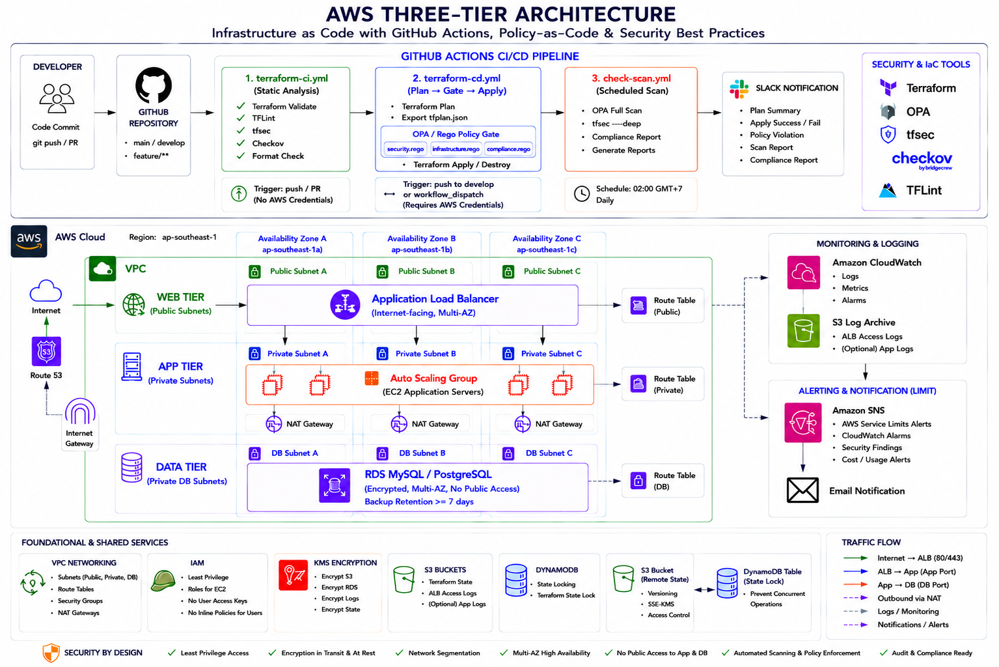

# AWS Three-Tier Architecture

Infrastructure AWS ba tầng được triển khai hoàn toàn bằng **Terraform**, bảo vệ bởi pipeline CI/CD trên **GitHub Actions** tích hợp kiểm tra bảo mật tự động ở mỗi bước trước khi apply.

---

## Mục lục

- [Kiến trúc tổng quan](#kiến-trúc-tổng-quan)
- [Mô hình kiến trúc tổng thể](#mô-hình-kiến-trúc-tổng-thể)
- [Thành phần hạ tầng](#thành-phần-hạ-tầng)
- [Cấu trúc thư mục](#cấu-trúc-thư-mục)
- [CI/CD Pipeline](#cicd-pipeline)
- [Policy-as-Code với OPA/Rego](#policy-as-code-với-oparego)
- [Yêu cầu trước khi chạy](#yêu-cầu-trước-khi-chạy)
- [Bắt đầu nhanh](#bắt-đầu-nhanh)
- [Tài liệu tham khảo](#tài-liệu-tham-khảo)

---

## Kiến trúc tổng quan

```
Internet
    │
    ▼
┌──────────────────────────────────────────────────────────────┐  Public Subnet
│   Application Load Balancer  (internet-facing, multi-AZ)     │  ap-southeast-1a/b/c
└──────────────────────────────────────────────────────────────┘
    │  HTTP/HTTPS
    ▼
┌──────────────────────────────────────────────────────────────┐  Private Subnet
│   EC2 Application Servers  +  Auto Scaling Group             │  ap-southeast-1a/b/c
└──────────────────────────────────────────────────────────────┘
    │  App port only (từ App SG)
    ▼
┌──────────────────────────────────────────────────────────────┐  Private Subnet (DB)
│   RDS MySQL / PostgreSQL  (encrypted, no public access)      │  ap-southeast-1a/b/c
└──────────────────────────────────────────────────────────────┘
```

Traffic từ internet chỉ vào được qua ALB. App tier nằm ở private subnet, chỉ nhận kết nối từ ALB Security Group. RDS nằm ở DB subnet group riêng biệt, chỉ nhận kết nối từ App tier Security Group — không có route nào ra internet trực tiếp.

---

## Mô hình kiến trúc tổng thể 


---

## Thành phần hạ tầng

### Web Tier — Public Subnet

| Thành phần | Chi tiết |
|------------|----------|
| Application Load Balancer | Internet-facing, bắt buộc multi-AZ (≥ 2 subnet) |
| EC2 Web Servers | Public subnet, port 80/443 mở từ internet |
| Internet Gateway | Cho phép traffic inbound/outbound public subnet |

### App Tier — Private Subnet

| Thành phần | Chi tiết |
|------------|----------|
| EC2 Application Servers | Private subnet, không có public IP |
| Auto Scaling Group | Trải trên ≥ 2 Availability Zone |
| NAT Gateway | Outbound-only internet (cập nhật package, gọi AWS API) |

### Data Tier — Private Subnet (DB)

| Thành phần | Chi tiết |
|------------|----------|
| RDS MySQL 8.0 / PostgreSQL | `publicly_accessible = false`, `storage_encrypted = true` |
| DB Subnet Group | Bắt buộc có `db_subnet_group_name`, không deploy trên public subnet |
| Backup | `backup_retention_period >= 7` ngày |

### Thành phần dùng chung

| Thành phần | Mục đích |
|------------|----------|
| VPC | `enable_dns_hostnames = true`, `enable_dns_support = true` |
| Route Tables | Bảng định tuyến riêng cho từng tier |
| Security Groups | Least-privilege theo từng tier, có description rõ ràng |
| IAM | Instance profiles, role-based — không gán policy trực tiếp vào user |
| CloudWatch | Log groups, metric alarms cho hạ tầng |
<!-- | CloudTrail | Multi-region, log file validation, tích hợp CloudWatch Logs | -->

---

## Cấu trúc thư mục

```
AWS-Three-Tier-Architecture/
│
├── .github/
│   └── workflows/
│       ├── terraform-ci.yml       # Static checks — không cần AWS credentials
│       ├── terraform-cd.yml       # Plan → OPA gate → Apply / Destroy
│       ├── check-scan.yml         # Quét bảo mật định kỳ hàng ngày
│       └── CICD-GUIDE.md          # Hướng dẫn setup và vận hành chi tiết
│
├── environments/
│   ├── dev/
│   │   ├── backend.tf             # S3 remote state: dev/terraform.tfstate
│   │   ├── main.tf                # Gọi các module
│   │   ├── variables.tf
│   │   ├── outputs.tf
│   │   ├── providers.tf
│   │   ├── versions.tf
│   │   └── terraform.tfvars       # Giá trị biến cho môi trường dev
│   └── prod/
│       └── ...                    # Cấu trúc tương tự dev
│
├── modules/
│   ├── vpc/                       # VPC, subnet, IGW, NAT, route table
│   ├── security-group/            # Security group per-tier
│   ├── alb/                       # Application Load Balancer
│   ├── ec2/                       # Web và App tier EC2
│   ├── s3/                        # Lưu trữ logs
│   ├── autoscaling/               # Auto Scaling Group cho App tier
│   ├── rds/                       # RDS MySQL/PostgreSQL
│   └── monitoring/                # CloudWatch, alarms, log groups
│
├── policies/
│   ├── security.rego              # EC2 IMDSv2, RDS, Security Group, IAM
│   ├── networking.rego            # VPC, subnet isolation, ALB, routing
│   └── compliance.rego            # CIS Benchmark v1.5.0 + Tagging policy
│
├── PROJECT.md
└── README.md
```

---

## CI/CD Pipeline & OPA/Rego Policies

```bash
Workflow Files
- terraform-ci.yml - CI checks for dev (validate, tflint, tfsec, checkov) - triggered on push/PR to develop and feature/**
- terraform-cd.yml - CD deployment for dev (plan, opa-gate, deploy, destroy)
- check-scan.yml - Periodic security scan (OPA full check, tfsec deep, reports)
- policies/security.rego - Security policies
- policies/networking.rego - Networking policies
- policies/compliance.rego - CIS Benchmark compliance
```

Ba workflow tách biệt theo mục đích, chạy độc lập.

```
Push lên feature/** hoặc develop
            │
            ▼
   ┌─────────────────┐
   │  terraform-ci   │  fmt · validate · TFLint · tfsec · Checkov
   └────────┬────────┘  (không cần AWS credentials, dùng -backend=false)
            │ pass
            ▼
   ┌─────────────────┐
   │  terraform-cd   │  plan → OPA gate → apply
   └────────┬────────┘  (chỉ chạy khi push lên develop hoặc workflow_dispatch)
            │
            ▼
   ┌─────────────────┐
   │   check-scan    │  OPA full scan + tfsec deep
   └─────────────────┘  (chạy tự động 02:00 GMT+7 hàng ngày)
```

### terraform-ci.yml — Kiểm tra tĩnh (Static Analysis)

Trigger: push lên `develop` / `feature/**`, hoặc Pull Request vào `develop`.
Không cần AWS credentials — tất cả bước dùng `terraform init -backend=false`.

> Trên nhánh `feature/**`: `SOFT_FAIL=true` — lỗi scan được báo cáo nhưng không block workflow.

| Job | Nội dung | Kết quả |
|-----|----------|---------|
| `validate` | `terraform fmt -check`, `init -backend=false`, `validate` | Fail nếu sai format hoặc cú pháp |
| `tflint` | AWS ruleset, naming convention, required providers, documented variables | Report JSON → artifact + comment PR |
| `tfsec` | Quét lỗi bảo mật IaC, so sánh với AWS best practice | Fail nếu tìm thấy lỗi nghiêm trọng |
| `checkov` | CIS / NIST / PCI DSS compliance scan | SARIF upload lên GitHub Security tab + comment PR |
| `ci-summary` | Tổng hợp kết quả 4 job trên | 1 comment tổng hợp trên PR + Slack notify |

### terraform-cd.yml — Plan, OPA Gate, Apply

Trigger: push lên `develop` (auto-apply) hoặc `workflow_dispatch` với lựa chọn `action`.

| Job | Nội dung |
|-----|----------|
| `plan` | `terraform init` với S3 backend thực, `terraform plan`, export ra 2 artifact: binary plan (cho apply) và JSON plan (cho OPA) |
| `opa-gate` | Tải JSON plan từ artifact, chạy lần lượt `security.rego` → `networking.rego` → `compliance.rego`. Bất kỳ rule `deny` nào trả về vi phạm sẽ block toàn bộ pipeline |
| `deploy` | `terraform apply` dùng binary plan đã duyệt — chỉ chạy sau khi `opa-gate` pass |
| `destroy` | `terraform destroy` — chỉ chạy khi `workflow_dispatch` với `action=destroy`, không bao giờ tự động |
| `notify` | Gửi Slack với trạng thái plan / opa-gate / deploy |

**workflow_dispatch options:**

| action | Hành động |
|--------|-----------|
| `plan` | Chỉ chạy plan, xem trước thay đổi, không apply |
| `apply` | plan → OPA gate → terraform apply |
| `destroy` | terraform destroy (yêu cầu xác nhận qua GitHub Environment) |

### check-scan.yml — Quét Bảo Mật Định Kỳ

Trigger: cron `0 19 * * *` (02:00 GMT+7 hàng ngày) hoặc `workflow_dispatch`.

| Job | Nội dung |
|-----|----------|
| `opa-full-scan` | Generate plan JSON mới nhất từ AWS, chạy cả 3 policy file, tách rõ `deny` và `warn` ra file `opa-results.json` |
| `tfsec-deep` | Quét toàn bộ rules không bỏ qua, output JSON |
| `generate-reports` | Tổng hợp bảng kết quả vào Step Summary, upload artifact, Slack |

**workflow_dispatch options:**

| scan_type | Hành động |
|-----------|-----------|
| `all` | Chạy cả OPA full scan và tfsec deep |
| `opa-only` | Chỉ chạy OPA với plan JSON mới nhất |
| `tfsec-only` | Chỉ chạy tfsec deep scan |

---

## Policy-as-Code với OPA/Rego

Mỗi lần chạy `terraform-cd.yml` và `check-scan.yml`, Terraform plan được export ra JSON và đưa qua 3 file policy trước khi bất kỳ resource nào được tạo.

```
tfplan.json
    │
    ├── policies/security.rego    → data.terraform.security.deny / .warn
    ├── policies/networking.rego  → data.terraform.networking.deny / .warn
    └── policies/compliance.rego  → data.terraform.compliance.deny / .warn
```

**Quy tắc phân loại:**
- `deny` — vi phạm nghiêm trọng, trả về message, pipeline dừng lại, không deploy
- `warn` — cảnh báo, in ra job log nhưng pipeline tiếp tục

### security.rego

Kiểm tra: EC2, Launch Template, RDS, Security Group, IAM.

| Rule | Loại |
|------|------|
| EC2 và Launch Template phải enforce IMDSv2 (`http_tokens = "required"`) | deny |
| RDS phải bật `storage_encrypted = true` | deny |
| RDS phải có `publicly_accessible = false` | deny |
| RDS phải có `backup_retention_period >= 7` | deny |
| Security Group không được mở SSH (22), RDP (3389) ra `0.0.0.0/0` | deny |
| Security Group không được mở MySQL (3306), PostgreSQL (5432) ra `0.0.0.0/0` | deny |
| Security Group không được có rule `protocol = -1` (all traffic) từ `0.0.0.0/0` | deny |
| IAM Policy không được có `Action=*` và `Resource=*` đồng thời (cả array và string format) | deny |
| Không được gán inline policy trực tiếp vào IAM user (`aws_iam_user_policy`) | deny |
| ALB nên bật `access_logs` | warn |
| RDS nên bật `deletion_protection` | warn |
| EC2 không có `key_name` nên đảm bảo có SSM Session Manager | warn |

### networking.rego

Kiểm tra: VPC, Subnet, EC2 App tier, RDS, ALB, Security Group.

| Rule | Loại |
|------|------|
| VPC phải có `enable_dns_hostnames = true` và `enable_dns_support = true` | deny |
| Subnet có tag `Tier=app` hoặc `Tier=database` không được `map_public_ip_on_launch = true` | deny |
| EC2 có tag `Tier=app` không được có `associate_public_ip_address = true` | deny |
| RDS phải có `db_subnet_group_name` (bắt buộc nằm trong DB subnet group) | deny |
| ALB có tag `Tier=web` phải có `internal = false` (internet-facing) | deny |
| ALB phải được deploy trên ít nhất 2 subnet (multi-AZ) | deny |
| Security Group không được để `description = "managed by terraform"` | deny |
| Security Group của DB tier không được có egress `protocol=-1` ra `0.0.0.0/0` | deny |
| VPC nên tạo `aws_flow_log` để ghi lại network traffic | warn |
| ALB Listener của Web tier nên dùng port 443 (HTTPS) | warn |
| Không tìm thấy `aws_nat_gateway` trong plan | warn |

### compliance.rego

Kiểm tra: S3, CloudTrail, IAM — theo CIS AWS Foundations Benchmark v1.5.0. Kèm theo Tagging policy tổ chức.

| Rule | CIS | Loại |
|------|-----|------|
| S3 phải có `server_side_encryption_configuration` | 2.1.1 | deny |
| S3 versioning phải `status = "Enabled"` | 2.1.2 | deny |
| S3 phải bật đủ 4 public access block settings | 2.1.3 | deny |
| Phải có ít nhất 1 `aws_cloudtrail` resource | 3.1 | deny |
| CloudTrail phải có `enable_log_file_validation = true` | 3.2 | deny |
| CloudTrail phải có `cloud_watch_logs_group_arn` | 3.4 | deny |
| CloudTrail phải có `is_multi_region_trail = true` | 3.5 | deny |
| Không được dùng `aws_iam_user_policy` hoặc `aws_iam_policy_attachment` với user | 5.1 | deny |
| IAM Policy không được có `Action=*` và `Resource=*` | 5.2 | deny |
| RDS phải có `storage_encrypted = true` | 5.4 | deny |
| Resource (EC2, RDS, ALB, VPC, Subnet, SG, S3) phải có tags: `Environment`, `Project`, `ManagedBy` | Org Policy | deny |
| S3 nên bật access logging | 2.1.4 | warn |
| Nên có `aws_cloudwatch_metric_alarm` cho unauthorized API calls | 4.1 | warn |
| RDS nên bật `multi_az` | — | warn |
| Auto Scaling Group nên trải trên ≥ 2 Availability Zone | — | warn |

---

## Yêu cầu trước khi chạy

| Yêu cầu | Dùng bởi |
|---------|----------|
| AWS Account + IAM User (programmatic access) | terraform-cd, check-scan |
| S3 bucket cho Terraform remote state (versioning + encryption bật) | terraform-cd, check-scan |
| DynamoDB table `terraform-state-lock` cho state locking | terraform-cd, check-scan |
| GitHub Secrets (5 biến, xem bảng bên dưới) | Cả 3 workflow |
| GitHub Environments: `development`, `production` | terraform-cd |
| `environments/dev/terraform.tfvars` với đủ giá trị biến | terraform-cd, check-scan |

### GitHub Secrets bắt buộc

| Secret | Mô tả |
|--------|-------|
| `AWS_ACCESS_KEY_ID` | Access key của IAM User |
| `AWS_SECRET_ACCESS_KEY` | Secret key của IAM User |
| `BUCKET_TF_STATE` | Tên S3 bucket lưu Terraform state |
| `DB_PASSWORD` | Mật khẩu RDS master (tối thiểu 8 ký tự) |
| `SLACK_WEBHOOK_URL` | Slack Incoming Webhook URL (tùy chọn) |

Xem `CICD-GUIDE.md` để biết cách tạo từng mục trên theo thứ tự từ bước 1.

---

## Bắt đầu nhanh

### 1. Tạo S3 backend và DynamoDB lock table

```bash
###########################################################
### CÓ 2 CÁCH TẠO ĐƯỢC HƯỚNG DẪN ###
########################################################### 

##### TẠO BẰNG CLI #####  
@@ Cái này nên vào .github/workflows/CICD-GUIDE.md sẽ rõ hơn 
# Tạo S3 bucket 
aws s3api create-bucket \
  --bucket <tên-bucket> \
  --region ap-southeast-1 \
  --create-bucket-configuration LocationConstraint=ap-southeast-1

aws s3api put-bucket-versioning \
  --bucket <tên-bucket> \
  --versioning-configuration Status=Enabled

# Tạo DynamoDB lock table
aws dynamodb create-table \
  --table-name terraform-state-lock \
  --attribute-definitions AttributeName=LockID,AttributeType=S \
  --key-schema AttributeName=LockID,KeyType=HASH \
  --billing-mode PAY_PER_REQUEST \
  --region ap-southeast-1

##### VÀO FOLDER BACKEND TẠO TẰNG TERRAFORM #####
terraform init

terraform plan

terraform apply
```

### 2. Cấu hình backend và tfvars

Cập nhật `environments/dev/backend.tf` với tên bucket, sau đó điền `environments/dev/terraform.tfvars` với các giá trị thực tế (VPC CIDR, instance type, AMI ID, ...).

### 3. Kiểm tra local trước khi push

```bash
cd environments/dev
terraform init
terraform validate
terraform fmt -recursive
```

### 4. Kích hoạt CI bằng cách push lên feature branch

```bash
git checkout -b feature/initial-infra
git add .
git commit -m "feat: initial three-tier infrastructure"
git push origin feature/initial-infra
# Tạo Pull Request vào develop -> terraform-ci.yml tự động chạy
```

### 5. Deploy lên dev

```bash
# Merge vào develop -> terraform-cd.yml tự động: plan -> OPA gate -> apply
git checkout develop
git merge feature/initial-infra
git push origin develop
```

---

## Tài liệu tham khảo

| Tài liệu | Nội dung |
|----------|----------|
| `CICD-GUIDE.md` | Hướng dẫn đầy đủ: tạo IAM, S3, DynamoDB, GitHub Secrets, Environments, xử lý lỗi thường gặp |
| [CIS AWS Foundations Benchmark v1.5.0](https://www.cisecurity.org/benchmark/amazon_web_services) | Tiêu chuẩn compliance được áp dụng trong `compliance.rego` |
| [OPA Documentation](https://www.openpolicyagent.org/docs/latest) | Tham khảo cú pháp Rego |
| [Terraform AWS Provider](https://registry.terraform.io/providers/hashicorp/aws/latest/docs) | Tài liệu resource được dùng trong modules |
| [tfsec Rules](https://aquasecurity.github.io/tfsec) | Danh sách rule tfsec áp dụng trong CI |
| [Checkov Checks](https://www.checkov.io/5.Policy%20Index/terraform.html) | Danh sách check Checkov áp dụng trong CI |
